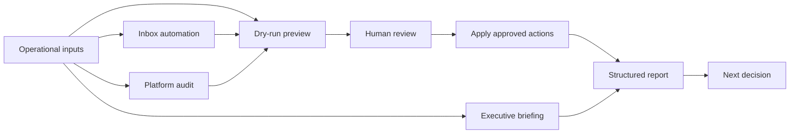

# Marketing Ops Toolkit

Practical automation scripts for performance marketing operations: inbox management, platform auditing, reporting workflows, and repeatable campaign-health checks.

This toolkit is built for operators who need faster diagnosis, cleaner execution, and less manual reporting drag.

## Why this exists

Marketing operations teams lose time and budget to predictable failures: campaigns pace incorrectly, conversion tracking goes stale, spend leaks into irrelevant search terms, and reports get assembled manually every week.

These scripts automate detection and diagnosis so operators can focus on decisions.

The goal is not to replace judgment. The goal is to surface issues earlier, reduce manual review, and make recurring workflows more reliable.

## Workflow

## Components

### Inbox automation (`src/inbox/`)

Rule-based email processing using the Gmail API. Categorizes, labels, archives, and prioritizes messages in batch.

- **Rule engine** — configurable pattern matching by sender, subject, and keywords
- **Batch processing** — labels and archives messages efficiently through API calls
- **State persistence** — tracks progress across runs and resumes where it left off
- **Dry-run mode** — previews changes before applying them

### Platform audit (`src/audit/`)

Automated health checks for Google Ads accounts and paid media operations.

- **Campaign structure audit** — hierarchy validation and naming-convention checks
- **Budget pacing** — spend vs. target tracking with alert thresholds
- **Conversion tracking audit** — validates tracking setup and identifies gaps
- **Search term analysis** — waste identification and negative keyword recommendations

### Reporting (`src/reporting/`)

Executive briefing generation from platform and workflow data.

- **Performance summary** — key metrics with period-over-period comparison
- **Anomaly flagging** — statistical deviation detection across campaigns
- **Formatted output** — clean summaries for Markdown, PDF, console, or downstream reporting

## Stack

- Python 3.12+
- Google Ads API (`google-ads`)
- Gmail API (`google-api-python-client`)
- Local configuration files
- No unnecessary framework layer

## Usage

Use the toolkit for Gmail inbox automation, Google Ads audits, and executive reporting workflows. Start in dry-run or preview mode before applying changes.

## Example output

See [`examples/example-run.md`](examples/example-run.md) for mock dry-run output covering inbox automation, campaign-health checks, audit findings, and recommended follow-up actions.

## Configuration

See [`config/README.md`](config/README.md) for setup instructions.

Do not commit local credentials, tokens, private account IDs, exports, or sensitive campaign data.

## Related repos

This repo is part of a connected public system. See the [GitHub Ecosystem Map](https://github.com/silvermanjared-web/growth-architecture-os/blob/main/docs/ecosystem-map.md) for how the repos relate.

Shared terminology: [Common Language](https://github.com/silvermanjared-web/growth-architecture-os/blob/main/docs/common-language.md).

Usage and rights: see [USAGE.md](USAGE.md).

- [`growth-architecture-os`](https://github.com/silvermanjared-web/growth-architecture-os)
- [`marketing-ops-playbooks`](https://github.com/silvermanjared-web/marketing-ops-playbooks)
- [`marketing-intelligence-agent`](https://github.com/silvermanjared-web/marketing-intelligence-agent)

## Design philosophy

- **Single-purpose scripts** — each file does one thing well
- **Batch over loop** — minimize API calls and maximize throughput
- **Dry-run everything** — preview before modifying
- **State machines** — support resume-safe, idempotent operations
- **No magic** — keep configuration explicit and code readable
- **Operator-first automation** — make the next decision easier, not just the next report faster

## What this demonstrates

This repo shows how recurring marketing operations problems can be turned into practical, reusable automation: structured inbox handling, platform-health checks, reporting workflows, and operating discipline around paid media execution.