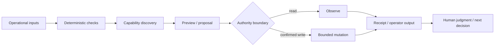

# Marketing Ops Toolkit 2.0

**A bounded execution layer for marketing operations.**

This repository turns recurring operational work into inspectable capabilities: platform health checks, inbox workflows, executive artifacts, and narrowly scoped mutations that can be used by humans or AI clients without granting general-purpose authority.

The design goal is simple: make ordinary marketing operations faster and more repeatable while keeping writes explicit, constrained, and auditable.

## Five-minute proof

Run:

```bash
npm test
python3 -m src.execution.bounded discover
```

The first command runs smoke, unit, and security tests. The second prints the real execution surface, including five bounded mutation contracts.

Then inspect:

- `src/execution/bounded.py` for capability discovery and bounded execution.
- `references/bounded-mutations.md` for the five mutation patterns.
- `src/inbox/accelerator.py` for the existing Gmail workflow.
- `src/audit/campaign_health.py` for Google Ads health checks.
- `docs/ai-operating-system-reference.md` for the shared architecture.

## Selected evidence

| Question | Evidence |
|---|---|
| Is this more than a bag of scripts? | One deterministic capability registry wraps the operational surface |
| Can writes stay narrow? | Five named mutation contracts, all confirmation-gated |
| Can local writes be contained? | Artifact writes are restricted to an admitted output root |
| Can it operate on real marketing systems? | Existing Gmail and Google Ads workflows remain available through narrow implementations |
| Can execution be audited? | Every bounded mutation returns a structured receipt |
| Can an AI client inspect before acting? | Capability discovery exposes effect, description, and confirmation requirements |

## What I built

The toolkit separates diagnosis from execution:


```mermaid
flowchart LR
    I[Operational inputs] --> D[Deterministic checks]
    D --> C[Capability discovery]
    C --> P[Preview / proposal]
    P --> A{Authority boundary}
    A -->|read| O[Observe]
    A -->|confirmed write| M[Bounded mutation]
    O --> R[Receipt / operator output]
    M --> R
    R --> J[Human judgment / next decision]
```

The execution layer does not create a general-purpose mutation interface. It exposes only admitted operations with explicit effect and authority rules.

## Core point of view

Marketing automation is useful when it reduces repetitive operator work without hiding what changed.

The operating standard is:

- deterministic before agentic when the task is deterministic;
- dry-run before mutation;
- explicit capability discovery;
- narrow targets;
- confirmation for writes;
- receipts after execution;
- no invented platform authority;
- no credential or client data in the public repository;
- the smallest governance layer that reliably contains risk.

## Signature framework: bounded mutation

A bounded mutation has five parts:

1. **Named capability** — the operation is explicit.
2. **Known target** — the system cannot wander outside the admitted boundary.
3. **Accepted inputs** — arguments are constrained.
4. **Authority rule** — confirmation or an existing admitted contract is required.
5. **Receipt** — success or refusal is inspectable afterward.

## Five bounded mutations

| Mutation | Boundary |
|---|---|
| `mutation.inbox_apply` | Existing Gmail rules and narrow apply workflow |
| `mutation.state_reset` | Local inbox-processing state |
| `mutation.brief_write` | Admitted output root |
| `mutation.audit_snapshot` | Admitted output root |
| `mutation.recommendations_export` | Admitted output root |

See [Five Bounded Mutation Patterns](references/bounded-mutations.md).

## Current capability surface

Read operations:

- `gmail.preview_rules`
- `ads.campaign_health`

Write operations:

- `mutation.inbox_apply`
- `mutation.state_reset`
- `mutation.brief_write`
- `mutation.audit_snapshot`
- `mutation.recommendations_export`

Run `python3 -m src.execution.bounded discover` for the machine-readable registry.

## Existing marketing operations utilities

The original operational workflows remain useful and are now framed as implementation adapters under the execution layer.

### Gmail

```bash
python3 -m src.inbox.accelerator
python3 -m src.inbox.accelerator --status
python3 -m src.inbox.accelerator --apply
python3 -m src.inbox.accelerator --reset
```

Preview is the default. The apply path changes Gmail state.

### Google Ads

```bash
python3 -m src.audit.campaign_health --days 30
```

Campaign-health checks remain read-only.

## AI and MCP interoperability

The execution contract is client-neutral. ChatGPT, Claude, CLI tooling, or an MCP-compatible client can expose the same capabilities while preserving their effect and confirmation requirements.

Protocol transport does not expand authority.

See [AI Operating System Reference](docs/ai-operating-system-reference.md).

## Ecosystem map

This repository is the execution layer in the broader [Growth Architecture OS](https://github.com/silvermanjared-web/growth-architecture-os) portfolio.

- **Growth Architecture OS**: leadership and operating philosophy.
- **Marketing Intelligence Agent**: signal synthesis, routing, and intelligence.
- **Marketing Ops Toolkit**: deterministic execution and bounded mutation.
- **AI Context & Design System**: structured context and implementation handoff.
- **Private-to-Public Release Gate**: privacy-safe publication boundary.

The canonical shared architecture lives in [AI Operating System Reference](https://github.com/silvermanjared-web/growth-architecture-os/tree/main/04-ai-systems/ai-operating-system-reference).

## How to read this repo

For a quick technical proof, run `npm test` and inspect `src/execution/bounded.py`.

For marketing utility, inspect `src/inbox/`, `src/audit/`, and `src/reporting/`.

For execution philosophy, read `references/bounded-mutations.md`.

For safety and authority, read `GOVERNANCE.md`, `SECURITY.md`, `CHATGPT.md`, and `CLAUDE.md`.

For evidence boundaries, read `proof-points.md`.

## Further reading

- [Bounded Mutations](references/bounded-mutations.md)
- [AI Operating System Reference](docs/ai-operating-system-reference.md)
- [Proof Points](proof-points.md)
- [Security Policy](SECURITY.md)
- [Usage and IP](USAGE.md)

## Related repos

- [Growth Architecture OS](https://github.com/silvermanjared-web/growth-architecture-os)
- [Marketing Intelligence Agent](https://github.com/silvermanjared-web/marketing-intelligence-agent)
- [Private-to-Public Release Gate](https://github.com/silvermanjared-web/private-to-public-release-gate)
- [AI Context & Design System](https://github.com/silvermanjared-web/brand-context-system)


## Federation

This repository is an autonomous member of the public [Growth Architecture OS federation](https://github.com/silvermanjared-web/growth-architecture-os/blob/main/docs/public-federation.md). It remains independently usable while publishing explicit contracts for what it provides, what it can consume, and the authority it retains locally.

See [FEDERATION.md](FEDERATION.md).

## IP and usage

This repository is public for professional review and portfolio context. It is not licensed for commercial reuse, resale, model training, or derivative productization without permission.

See [USAGE.md](USAGE.md).